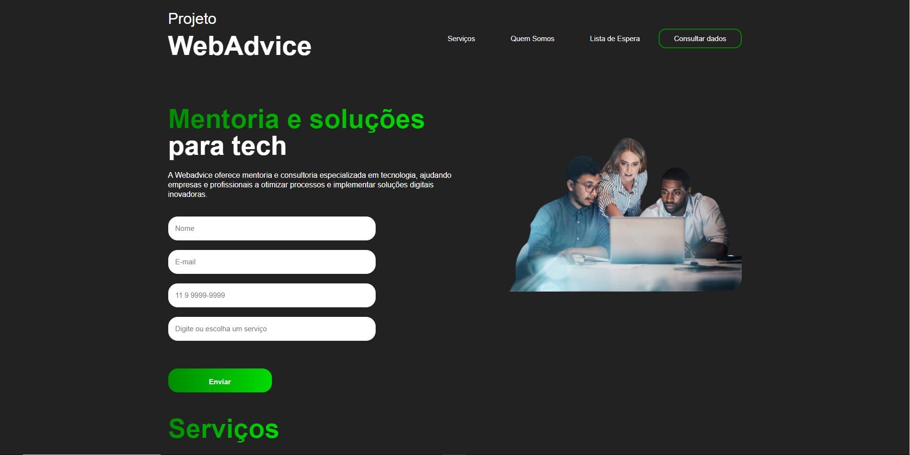
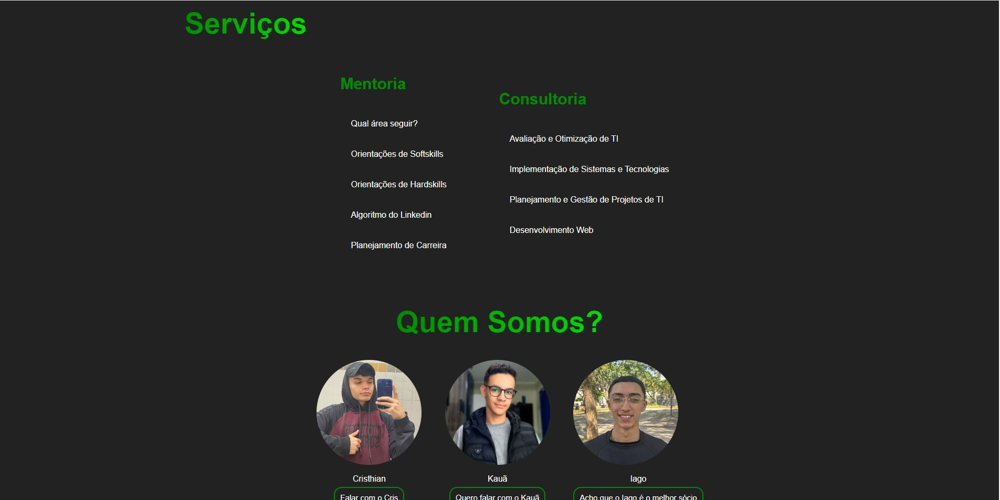
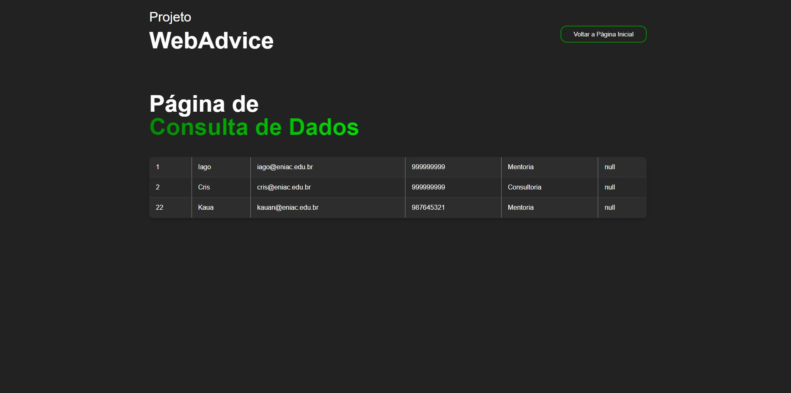

# WebAdvice
Este site foi desenvolvido com o objetivo de fornecer mentorias e consultorias sobre diversas áreas da tecnologia.
O projeto foi proposto pela Faculdade ENIAC, onde deveriamos criar um site fullstack, tendo assim o front-end em HTML e CSS, back-end em Java e um banco de dados em MySQL, tudo isto sendo unido em um servidor Tomcat.
No site é possível o usuário realizar o seu cadstro para assim entrar em uma lista de espera, onde a própria empresa entraria em contato com os leads, acessando os dados na página Consultar Dados.

## Serviços

## Quem somos

## Consultar Dados

